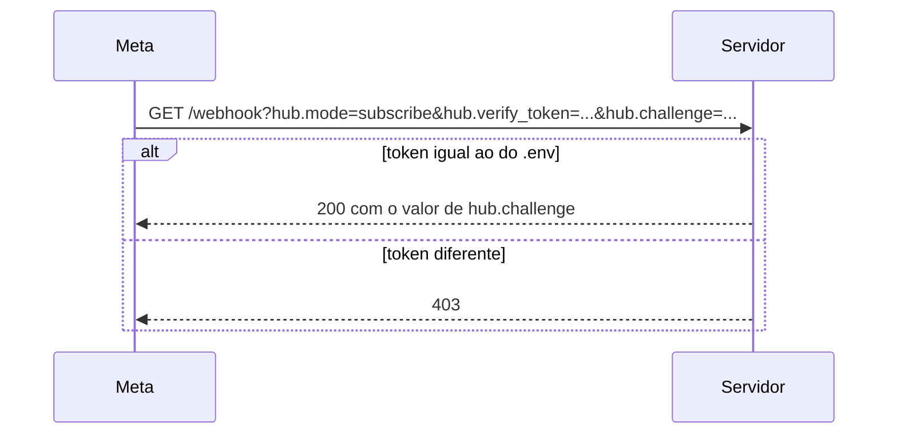
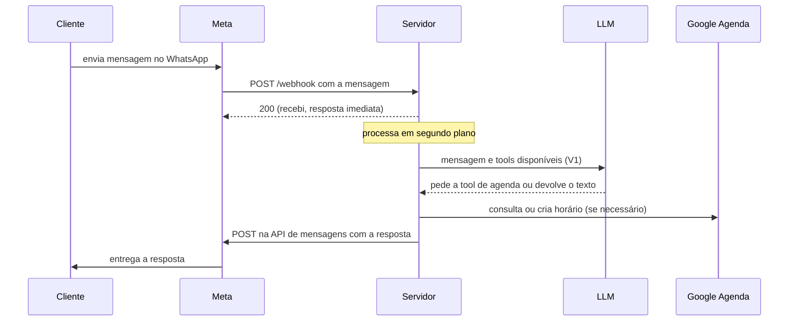

# Arquitetura (V0)

## 1. Verificação do webhook (acontece uma vez, ao cadastrar a URL na Meta)

```mermaid
sequenceDiagram
    participant Meta
    participant Servidor
    Meta->>Servidor: GET /webhook?hub.mode=subscribe&hub.verify_token=...&hub.challenge=...
    alt token igual ao do .env
        Servidor-->>Meta: 200 com o valor de hub.challenge
    else token diferente
        Servidor-->>Meta: 403
    end
```

## 2. Mensagem de uma cliente (acontece sempre)

```mermaid
sequenceDiagram
    participant Cliente
    participant Meta
    participant Servidor
    participant LLM
    participant Agenda as Google Agenda
    Cliente->>Meta: envia mensagem no WhatsApp
    Meta->>Servidor: POST /webhook com a mensagem
    Servidor-->>Meta: 200 (recebi, resposta imediata)
    Note over Servidor: processa em segundo plano
    Servidor->>LLM: mensagem e tools disponíveis (V1)
    LLM-->>Servidor: pede a tool de agenda ou devolve o texto
    Servidor->>Agenda: consulta ou cria horário (se necessário)
    Servidor->>Meta: POST na API de mensagens com a resposta
    Meta->>Cliente: entrega a resposta
```
